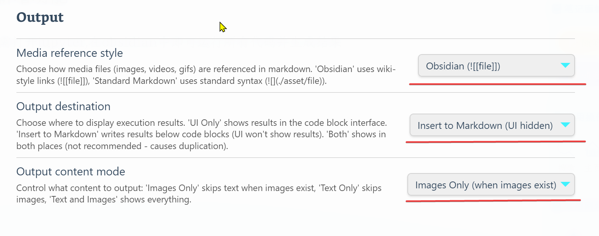
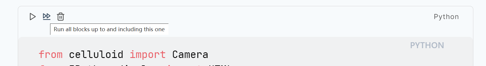

## 项目说明

在[jupymd](https://github.com/d-eniz/jupymd)项目基础上修改而来，详细用法见原作者仓库

## 新增功能

>[!note]
>无需打开jupyter
>
>在obsidian中即可运行所有代码并生成结果
>
>生成的结果文件保存在本地
>
>方便同步和导出PDF

- 直接运行所有代码块功能，就像在jupyter中一样
- 只运行当前代码块
- 运行到当前代码块的之前所有代码块(包括当前代码块)
- 清除输出结果
- 生成的文字/图片/视频结果会嵌入到obsidian中(可以选择obsidian语法或者标准markdown语法)

### 演示视频

## 使用指南

>[!tip]
>下载md2jupyter文件夹并放到你的obsidian插件目录即可

### 1.请确保配置好相应的jupyter环境，并正确配置python路径

### 2.在插件设置中，设置你喜欢的结果呈现方式

### 3.点击运行按钮，查看结果！

#### 图片嵌入

#### 视频嵌入

## 写在最后

如果该项目节省了您宝贵的时间
请点一个star吧！⭐
或者buy me a coffee ☕

